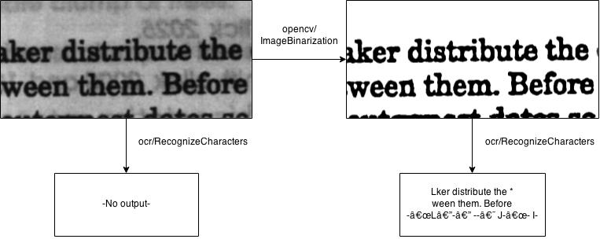

# Optical Character Recognition

Our OCR algorithm uses [Tesseract]() and its latest trained models. Tesseract is an open source OCR library that is currently being developed by Google. This algorithm uses the [model](https://drive.google.com/folderview?id=0B7l10Bj_LprhQnpSRkpGMGV2eE0&usp=sharing) trained on English character set. You are welcome to take this algorithm as an example and use other models. The algorithm makes use of [OpenCV’s image converter]() since Tesseract handles the tiff format. Please be aware that if you feed the algorithm an image in any format other than tiff, the algorithm will call the image converter and write the output to your collection, then operate on the converted image. 
      
There is an [image binarization algorithm]() on Algorithmia that cleans the noise in a given image. If the image you are trying to extract the text from is noisy, you may want to use that algorithm first.



The first input to the algorithm is the link to the image file on the [Data](http://algorithmia.com/data) Api and the second input to the algorithm is the Data collection where the extracted text should be written to. Sample image taken from Adaptive document image binarization, J. Sauvola, M. Pietikainen, Pattern Recognition 22 (200) 225-236.

Here is a code sample for calling the algorithm from Scala. Do not forget to create the collection from the [Data](http://algorithmia.com/data) Api and upload the sample image first. The code sample below depends on the [Scalaj](https://github.com/scalaj/scalaj-http) library, so include the dependency first in build.sbt by adding:

```
scalaVersion := "2.11.4"

libraryDependencies += "org.scalaj" % "scalaj-http_2.11" % "1.1.4"
```

```
	val result = Http("http://api.algorithmia.com/api/ocr/RecognizeCharacters")
	.postData("[""data://USERNAME/SampleImages/ocrsample.tiff"",""data://USERNAME/SampleImages/recognized-text.txt""]")
    .header("Content-Type", "application/json")
    .header("Authorization","YOUR_API_KEY")
    .header("Accept","application/json")
    .option(HttpOptions.connTimeout(10000))
    .asString
    .body
    println(result)
```