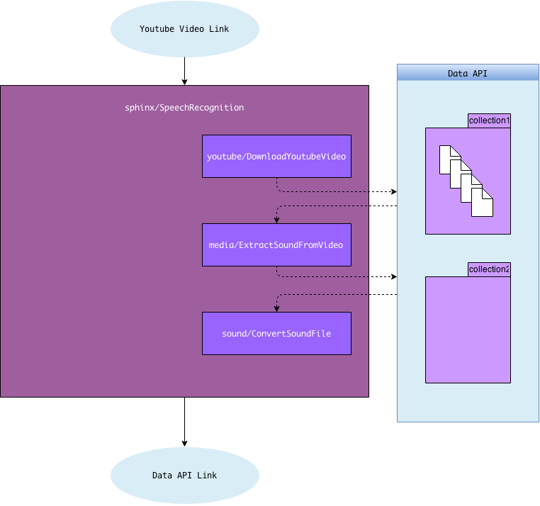

# Speech Recognition

The speech recognition (SR) algorithm on the platform uses [CMU Sphinx](http://cmusphinx.sourceforge.net/), an open source library. The trained models are obtained from the [SourceForge page](http://sourceforge.net/projects/cmusphinx/files/Acoustic%20and%20Language%20Models/) and are the latest in English model. If you would like to use different models in your speech recognition task, please feel free to use this algorithm as an example. We currently have two different algorithms under the sphinx namespace. The [Adaptive SR algorithm](https://algorithmia.com/algorithms/sphinx/AdaptiveSpeechRecognition) takes twice as long as the generic [SR algorithm](https://algorithmia.com/algorithms/sphinx/SpeechRecognition) because it makes an effort to adapt the recognition stats to the specific speaker by “listening to” the audio twice. If you are interested in this paradigm, you can read more about it here: http://www.cs.cmu.edu/afs/cs/user/robust/www/Thesis/doh_thesis.pdf


The first input to the algorithm is the link to the media file (either a [Data](https://algorithmia.com/data) url that contains a sound file or a Youtube video url) and the second input to the algorithm is the collection where the extracted text should be written to (a Data url). Here is a Java code that sends a request. Note that we added the async flag due to the fact that it takes as ong as the video duration for the SR algorithm to run. The results will be written to the Data url specified. Also note that this code depends on [Gson](https://code.google.com/p/google-gson/) and [Apache Commons](https://commons.apache.org/proper/commons-io/apidocs/org/apache/commons/io/IOUtils.html) libraries.

```
		URL url = new URL("http://api.algorithmia.com/api/sphinx/SpeechRecognition?async=void");
        URLConnection urlConnection = url.openConnection();
        urlConnection.setDoInput(true);
        urlConnection.setDoOutput(true);
        urlConnection.setRequestProperty("Content-Type", "application/json");
        urlConnection.setRequestProperty("Authorization", "YOUR_API_KEY");
        urlConnection.setRequestProperty("Accept", "application/json");
        urlConnection.connect();
        OutputStreamWriter outputStream = new OutputStreamWriter(urlConnection.getOutputStream());
        JsonArray inputArray = new JsonArray();
        JsonPrimitive prim = new JsonPrimitive("https://www.youtube.com/watch?v=CuA7p1RbLKo");
        inputArray.add(prim);
        prim = new JsonPrimitive("data://USERNAME/COLLECTION_NAME/speech.txt");
        inputArray.add(prim);
        outputStream.write(new Gson().toJson(inputArray));
        outputStream.flush();
        outputStream.close();
        HttpURLConnection httpConn = (HttpURLConnection) urlConnection;
        InputStream is;
        if (httpConn.getResponseCode() >= 400) {
            is = httpConn.getErrorStream();
        } else {
            is = httpConn.getInputStream();
        }
        List<String> list = IOUtils.readLines(is,"UTF-8");
        StringBuilder sb = new StringBuilder();
            for(String s : list){
                sb.append(s + "\n");
            }
        System.out.println(sb.toString());
```

We can only process the Youtube videos that are licensed under the Creative Commons license due to the prohibitive nature of the Standard Youtube License. The algorithm runs the raw Youtube video found in the link through a pipeline of downloading it, extracting the sound, converting the sound file to the correct format and then performing SR on it. If instead of a Youtube link, a link to a file in a Data collection is given; the algorithm treats it as a sound file and just converts it to the correct format before performing SR. If you would like to upload a video file, you can preprocess it with the [sound extraction algorithm](https://algorithmia.com/algorithms/media/ExtractSoundFromVideo).

